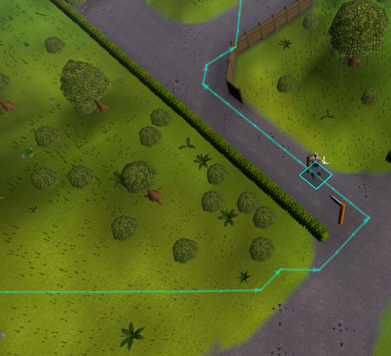
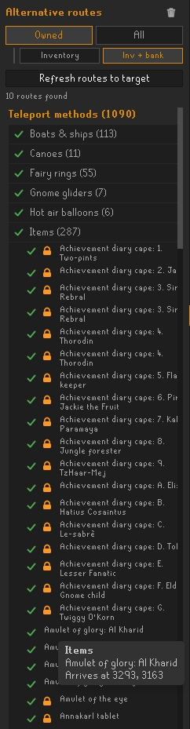

# Shortest Path ALT

**Shortest Path ALT** finds the quickest route to any destination in Old School RuneScape and — unlike the classic pathfinder — surfaces *several* ways to get there, each using a different set of teleports and transports. See the options side by side, pick the one that suits the items you actually have (or the spot you want to end up), and preview any of them on the world map before you move.

It is a fork of, and a superset of, the original [Shortest Path](https://github.com/Skretzo/shortest-path): the classic "draw the shortest path to a destination" behaviour is all still here, with an alternative-routes explorer built on top.

## Features

- **Shortest path drawing** — set a destination (right click a spot on the world map, or shift right click a tile) and the shortest route is drawn on the scene, minimap and world map. Also picks up destinations set by **Quest Helper**.
- **Alternative routes panel** — a side panel lists up to 25 alternative routes to the current destination, each using a *different* travel method, ordered by cost. Routes stream in as they are found, and each card shows its blended cost, the methods it uses, and tags such as `walk`, `bank` or `closest`.
- **Click to preview** — click any route card to draw that route everywhere (scene, minimap, world map) instead of the default one; click again to clear.
- **Teleport-method catalog** — a collapsible, categorised list of every teleport/transport method, with per-method and per-category include/exclude toggles. Exclude a method (e.g. "no fairy rings") and the routes recompute without it. Exclusions are saved between sessions.
- **Availability markers** — methods you can't use right now are greyed out with an icon and a reason on hover (missing item, in your bank, level too low, quest not done, or not unlocked).
- **Availability modes** — choose how much to consider (see the table below): only what you carry, what you carry plus your bank, everything you've unlocked, or every teleport in the game.
- **Travel-method weights** — each method carries a configurable "extra steps" weight, so the route only uses a teleport when it genuinely saves more walking than the weight (e.g. a fairy ring is skipped unless it saves more than ~30 tiles). Walking near-ties beat fiddly teleports. A separate weight covers detouring through a bank to withdraw an item.
- **Arrow-line rendering** — the path is drawn as a directional arrowed line by default (Tiles and Lines styles are still available), with an optional per-tile counter.
- **Teleport pulse** — when the path tells you to use a teleport item or spell, a pulsing highlight animates on the tile you cast from so the "teleport now" moment is easy to spot.

## Screenshots

**Alternative-routes panel with the teleport-method catalog**

**A selected route previewed on the world map**

**The teleport-method catalog with availability markers**

## Getting started

1. Enable **Shortest Path ALT** from the Plugin Hub (it also appears when you search for "shortest path").
2. Set a destination: **right click** a spot on the world map, or **shift + right click** a tile in the scene.
3. Open the side panel from the navigation button (the map-marker icon) to see the alternative routes and the method catalog.
4. Press **Refresh routes to target** to (re)compute alternatives for whatever destination is currently set, then click a route to preview it.

## Availability modes

The panel has two families, each with two variants. Switching family keeps your variant position.

| Family | Variant | What it considers |
|:--|:--|:--|
| **Owned** | Inventory | Only methods whose items you carry (inventory + equipment) |
| **Owned** | Inventory + bank | Also items in your bank — routes walk to a bank to withdraw them |
| **All** | Available | Ignores item possession, but only methods your character has unlocked (skills, quests, diaries) |
| **All** | Everything | Every teleport in the game, including ones you can't use yet |

## Configuration highlights

- **Routes to find** — how many alternatives to compute by default (1–25); a *Show 5 more* button fetches more on demand.
- **Travel method weights** — a collapsed config section with a per-method-type "extra steps" weight (and a bank-pickup weight). Raise a method's weight to make the path avoid it unless it saves that many tiles; set `0` to treat it as free.
- **Path style** — Arrowed line (default), Lines, or Tiles, plus colours, tile counter, and transport-info hints.

Method include/exclude is done in the panel catalog rather than the config menu.

## Credits

Shortest Path ALT is a fork of **[Shortest Path](https://github.com/Skretzo/shortest-path)** by Runemoro, Skretzo, FIrgolitsch, wvanderp and contributors, used under the BSD 2-Clause licence (see [LICENSE](LICENSE)). All of the pathfinding engine, collision data and transport/destination data come from that project; this fork adds the alternative-routes explorer, the method catalog, the availability modes and markers, the travel-method weights, and the arrow-line/pulse rendering.

If you only want the classic shortest-path drawing, use the original plugin from the Plugin Hub — this fork exists for exploring and comparing the different ways to reach a destination.

Additional attributions:

- The path arrowheads are adapted from **Quest Helper**'s `DirectionArrow.drawLineArrowHead` (Copyright © 2021, [Zoinkwiz](https://github.com/Zoinkwiz), BSD 2-Clause), as also used by the port-tasks plugin.
- The side-panel UI takes its styling cues from the RuneLite **tile-packs** plugin, and the arrow-line path rendering was modelled on the **port-tasks** plugin.
- Built for [RuneLite](https://runelite.net/).

## Issues, bugs, suggestions and help
|Problem|Link|
|:--|:-:|
|**🐛 Bug report** Report an issue encountered while using the plugin, or take a look at [already reported bugs](../../issues?q=is%3Aopen+is%3Aissue+label%3Abug).||
|**💡 Feature request** Request a new feature or suggestion, or take a look at [already reported enhancements](../../issues?q=is%3Aopen+is%3Aissue+label%3Aenhancement).||

## Developer tooling

Developer dashboards and OSRS cache dumpers live in [shortest-path-tooling](https://github.com/osrs-pathfinding/shortest-path-tooling).
The published dashboard is available on GitHub Pages: `https://skretzo.github.io/shortest-path/`

## License

BSD 2-Clause — see [LICENSE](LICENSE).
