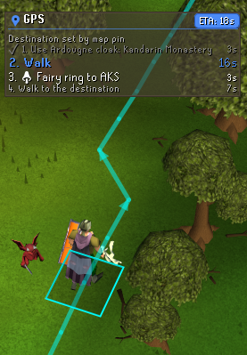
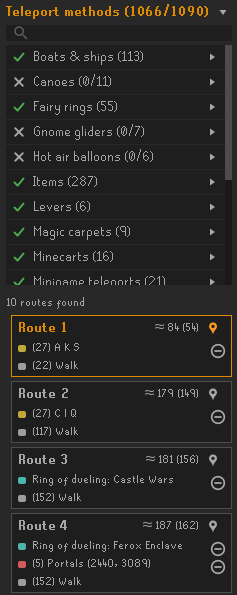

# Rune GPS Plugin

**Rune GPS Plugin** is turn-by-turn navigation for Old School RuneScape. Set a destination and it draws the fastest route, lists the steps to follow and tracks your progress live with an ETA, and tells you when you've arrived. And because the fastest route isn't always *your* route, it also surfaces several alternative ways to get there, each using different teleports and transports, so you can pick the one that suits what you actually carry.

It grew out of, and supersedes, a fork of the original [Shortest Path](https://github.com/Skretzo/shortest-path): the classic "draw the shortest path" behaviour is all still here, with a navigation layer and an alternative-routes explorer built on top.

## Features

### Navigation
- **Turn-by-turn directions** — a movable GPS panel lists the route as numbered steps: walking legs, "Open Door" for doors on the way, teleports and transports to use, bank detours with what to withdraw, and climbs. The step being executed is highlighted; completed steps grey out and collapse.
- **Live progress and ETA** — progress is tracked from your actual position (including mid-flight on carpets, canoes and gliders, where the ETA counts down through the ride), with a per-step time and a floating ETA badge.
- **Closed-door awareness** — the collision map assumes doors are open, so GPS carries a registry of every openable door and gate in the game (2,977 of them): doors on your route become their own step, and a world label appears on a door ahead while it is actually closed, disappearing the moment you open it.
- **Flowing route line** — the path is drawn as a directional arrowed line toward the destination, with section markers where each step ends.

### Alternative routes
- **Routes panel** — a side panel (the blue pin icon) lists up to 25 alternative routes to the current destination, each using a *different* travel method, ordered by cost and streamed in as they are found.
- **Click to preview** — click any route card to draw that route everywhere (scene, minimap, world map); the GPS directions follow the route you picked.
- **Teleport-method catalog** — a collapsible, categorised, searchable list of every teleport/transport method, with per-method and per-category include/exclude toggles. Exclusions persist between sessions and also apply to the main path.
- **Availability markers** — methods you can't use right now are marked with a reason on hover (missing item, in your bank, level too low, quest not done, or not unlocked).
- **Availability modes** — only what you carry, what you carry plus your bank (routes will detour to withdraw), everything you've unlocked, or every teleport in the game.
- **Travel-method weights** — each method type carries a configurable "extra steps" weight, so a teleport is only used when it saves more walking than it costs in fuss; a separate weight prices bank detours.

### Integration
- Picks up destinations set by **Quest Helper** (and any other plugin using the `shortestpath` plugin-message API), and shows who set the current destination.
- Right click a spot on the **world map**, or shift + right click a tile in the scene, to set a destination yourself.

**Alternative-routes panel with the teleport-method catalog**

## Getting started

1. Enable **GPS** from the Plugin Hub.
2. Set a destination: **right click** a spot on the world map, or **shift + right click** a tile in the scene — or let Quest Helper set one.
3. Follow the GPS panel; drag it wherever you like.
4. For alternatives, open the side panel (the blue pin icon), then click a route to travel it instead.

## Availability modes

The panel has two families, each with two variants. Switching family keeps your variant position.

| Family | Variant | What it considers |
|:--|:--|:--|
| **Owned** | Inventory | Only methods whose items you carry (inventory + equipment) |
| **Owned** | Inventory + bank | Also items in your bank — routes walk to a bank to withdraw them |
| **All** | Available | Ignores item possession, but only methods your character has unlocked (skills, quests, diaries) |
| **All** | Everything | Every teleport in the game, including ones you can't use yet |

## Configuration highlights

- **Directions panel** — toggle the GPS overlay, the teleport pulse and the transport hints; pick colours and path style (arrowed line, lines or tiles).
- **Routes to find** — how many alternatives to compute by default (1–25); a *Show more routes* button fetches more on demand.
- **Travel method weights** — a collapsed section with a per-method-type "extra steps" weight (and a bank-pickup weight). Raise a weight to avoid that method unless it saves that many tiles; set `0` to treat it as free.

## Credits

GPS is built on **[Shortest Path](https://github.com/Skretzo/shortest-path)** by Runemoro, Skretzo, FIrgolitsch, wvanderp and contributors, used under the BSD 2-Clause licence (see [LICENSE](LICENSE)). The pathfinding engine, collision data and transport/destination data all come from that project; Rune GPS adds the turn-by-turn navigation (directions, progress, ETA, arrival), the door registry and hints, the alternative-routes explorer, the method catalog with availability modes and markers, the travel-method weights, and the route rendering (arrow line, flowing glow, pulses and markers).

## Issues, bugs, suggestions and help
|Problem|Link|
|:--|:-:|
|**🐛 Bug report** Report an issue encountered while using the plugin, or take a look at [already reported bugs](../../issues?q=is%3Aopen+is%3Aissue+label%3Abug).||
|**💡 Feature request** Request a new feature or suggestion, or take a look at [already reported enhancements](../../issues?q=is%3Aopen+is%3Aissue+label%3Aenhancement).||

## Developer tooling

OSRS cache dumpers (collision map, bank tiles, the door registry) and pathfinding dashboards live in [shortest-path-tooling](https://github.com/osrs-pathfinding/shortest-path-tooling).

## License
BSD 2-Clause — see [LICENSE](LICENSE).
